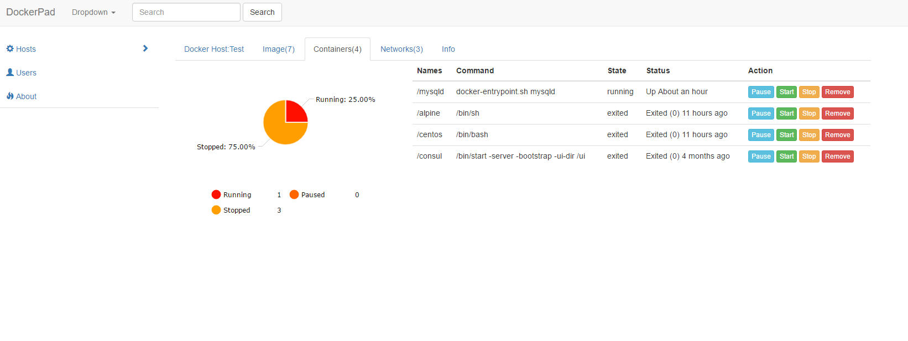

#Dockerpad
##This Project has bean closed(2017-01-11)
More useful project:

* [RANCHER](http://rancher.com/)
* [DOCKER SWARM](https://github.com/docker/swarm)
* [KUBERNETES](https://github.com/kubernetes/kubernetes)
* [MESOS](http://mesos.apache.org/)

## Intro
  This project is a Web UI for `Docker`.Current status is : `developing`
  
## Get started
## Dependancies
1 Angular
2 Bootstrap
3 Spring Boot
